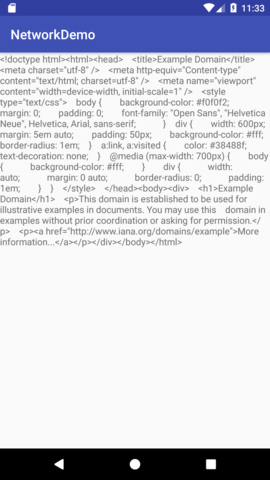

# Android Networking

Android performs network related operations on the background thread.

All the network requests have to be performed over a protocol. Like it can be over HTTP and this defines the format of its payload. FTP will have a FTP payload and will not be able to read HTTP payload. Hence, it is important to define a protocol in any network request. We will be using HTTP request.

We need a protocol client to handle a protocol. We will need to set up an HTTP protocol client to send HTTP requests.

Response from the server take variable time and UI thread can't be blocked. So we use AsyncTask to send the network request in the background.

**Stream**-> We require streams to read and write data to the files. Whenever if our program has to get data from an external source it is Input Stream. Whenever our program has to write data, it is output stream. The streams are always seen w.r.t to your program.

Now the main question is, why do we need streams? Why can't we simply read all data at once?
There are basically two reasons
1. The speed of the data to your program will be different from the rate at which your program can read. To synchronize this data speed we need streams.

2. We don't have large RAM space. So we can't always read or write a file in the RAM. Only some part of the file must be present, so when we read a file/write, we do it in chunks. And these chunks are what makes the stream.

We also need a buffer to store the file in a local buffer, which when full, data is read from it.

So we create InputStream to read from the network and to read data from stream we will use buffered reader.

To make a network request in the app, we need to add permission in manifest file.
```xml
<uses-permission android:name="android.permission.INTERNET"/>
```
We start by making a AsyncTask. And our downloaded Asynctask will look like
```java

public class DownloadAsyncTask extends AsyncTask<String, Void, String> {


    private TextView tvResult;


    public DownloadAsyncTask(TextView tvResult) {
        this.tvResult = tvResult;
    }


    protected String doInBackground(String... strings) {
        // Some long-running task in backgorund

        URL url = null;
        String result = "";
        try {
            url = new URL(strings[0]);
        } catch (MalformedURLException e) {
            e.printStackTrace();
        }

        HttpURLConnection connection = null;

        try {
            //Sets up HTTP URL connection
            connection = (HttpURLConnection) url.openConnection();
            //Gives the data in form of bytes
            InputStream netInputStream = connection.getInputStream();

            //Converts that byte data using charset
            InputStreamReader isr = new InputStreamReader(netInputStream);

            //Helps read data in chunks
            BufferedReader br = new BufferedReader(isr);

            StringBuilder sb = new StringBuilder();
            String buffer = "";

            while(buffer!=null) {
                sb.append(buffer);
                buffer = br.readLine(); // Returns null after all work
            }

            result = sb.toString();

        } catch (IOException e) {
            e.printStackTrace();
        }
        return result;
    }

    protected void onPostExecute(String result) {
        tvResult.setText(result);

    }
}
```
We call this AsyncTask from our activity like
```java
new DownloadAsyncTask((TextView) findViewById(R.id.tvResult))
                .execute("http://example.com");
```

